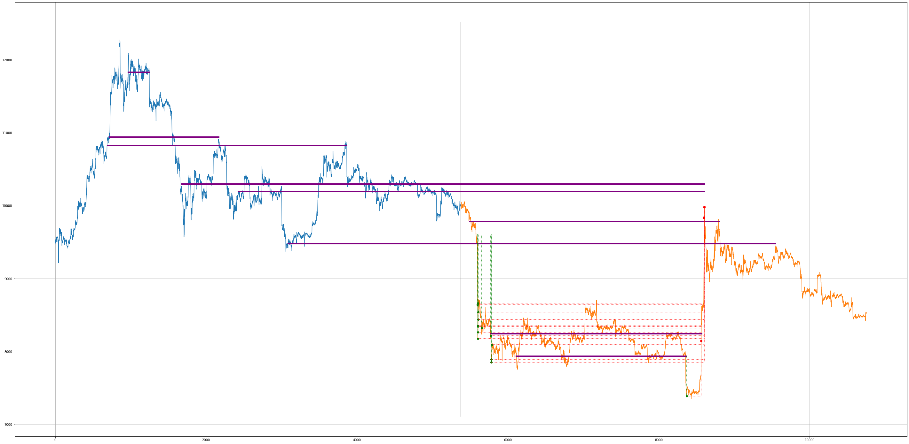
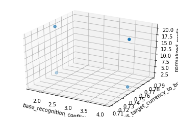

# Repository content

This repository contains scripts simulating trading of crypto currency coins.

Disclaimer: These scripts are proofs of concepts. They are not ready to be used
for a real trading.

# Algorithm based on broken supports

## Summary

The Jupyter Notebook file `broken_supports_algorithm.ipynb` contains
an algorithm based on broken supports. The algorithm should buy cheap when
other investors are in panic and hence they are selling. Then, when the
investors have calmed down and the price has risen again and come closer to the
broken support, the algorithm should sell.

The motivation to develop this algorithm was one of the videos of Quickfingers
Luc (such as https://www.youtube.com/watch?v=vgcFe_XO_LQ).

## Environment preparation

Necessary python3 packages:
- jupyter
- pandas
- PyFunctional

You can install them for instance via

`python3 -m pip install --user jupyter pandas PyFunctional`

## Execution

1. Execute `jupyter notebook`
1. Open `broken_supports_algorithm.ipynb` in the started Jupyter Notebook
editor.
1. Click on "Run" for each code snippet, starting with the first code snippet
and following with the second one, third one, etc. The last code snippet
triggers the simulation; either
`currency_pair_evaluator.evaluate_one_time_frame_and_draw_and_close(..)` or
`currency_pair_evaluator.evaluate_multiple_time_frames_and_draw_and_close(..)`.

NOTE: This algorithm is not designed to be used for a real trading, hence no
secrets are necessary.

## Dictionary

The **base currency** is the currency kept long term due to its limited
volatility and high liquidity. The **market (=target) currency** is the
currency which ups and downs expressed in the base currency wanted to be
leveraged to achieve profit. The **currency pair** BTC-USDT consists of the
market currency BTC and the base currency USDT.

From https://en.wikipedia.org/wiki/Support_and_resistance :

> In stock market technical analysis, **support** and **resistance** are certain
predetermined levels of the price of a **security** at which it is thought that
the price will tend to stop and reverse. These levels are denoted by multiple
touches of price without a breakthrough of the level.

The **base** is either support or resistance. Note a support may become
a resistance and vice versa.

The specification which base is strong and which is not
can be found in the section "How is a strong base identified?".

Assume that a strong base is being broken
the first time. The graph of the currency pair is **healthy** if the price comes
back to the base price in a close future and this happens for every strong base
. Note the price can start falling (resp. rising) again just after the price has
come back to the broken support (resp. resistance).

## Algorithm

### Theory of the algorithm

When a strong support is being broken in the health graph the first time,
the algorithm waits till the price has fallen enough and then starts buying.
If the price continues falling, the algorithm continues buying, even more
than before. Since the algorithm operates on the health graph, there
is a strong assumption the price comes back to the broken support in the close
future. The algorithm sells such an amount of the market currency coins for the
price not higher than the base price that the algorithms retrieves its initial
investment back and hereby reduces the chance of loss. The rest of the market
currency coins is tried to be sold for higher price.

### Challenges of the algorithm

The theory contains expressions which needs to precisely specified:
 
1. How is a strong base identified?
1. How is a broken base identified?
1. When should the algorithm start buying? (= What is the highest
"allowed" purchase price?)
1. How much market currency should the algorithm buy?
1. When should the algorithm sell market currency?
1. How long can the comeback to the price broken support take?
1. What should the algorithm do when the comeback seems to not come?

These challenges are addressed in the section "Implementation of the algorithm".

### Implementation of the algorithm

#### How is a strong base identified?

Human generally prefers round numbers and may tend to use them as boundaries
in their limit orders. Trading bots operating on exchanges may follow large
variety of different strategies. Me and my friend Preslav
Rachev (his LinkedIn profile https://www.linkedin.com/in/preslavrachev/) came
up with an idea to divide the chart into price intervals further called
**price bins** and analyze these bins for being a base. This approach also
helps to filter out candlesticks going slightly below (resp. above) a
particular price since these candlesticks do not necessary mean that the
support (resp. resistance) has been being broken.

The goal of the algorithm is to use the panic situations. These can be
characterized for instance by larger volume and major price changes. The
algorithm is using **volume**.

The algorithm denotes a price bin as a base only if all of three following
conditions are satisfied:
- if the maximum of volume of all candlesticks in the price bin exceeds a
certain value calculated
  - using the mean of volume of all training candlesticks,
  - using the median of volume of all training candlesticks and
  - using `base_recognition_coefficient` (see the section "Further algorithm
configuration") and
- if the mean of volume - of all candlesticks directly preceding the
currently analyzed candlestick and belonging to the same price bin - is
greater than a mean of volume of all training candlesticks and eventually
- if the **base score** of the price bin is equal or greater that a required
lower bound `min_base_score` (see the section "Further algorithm
configuration"). The base score is calculated
  - using the maximum of volume - of all candlesticks directly preceding the
   currently analyzed candlestick and belonging to the same price bin
    -,
  - using the maximum of volume of all preceding candlesticks and
  - using the maximum of volume of the preceding price bin (to express a trend).

Note the identification and re-assessment whether a price bin is a base
happens both in the training and simulation phase.

#### How is a broken base identified?

The algorithm does not operate with the term broken base. The algorithm uses
a configuration parameter `min_buy_order_profit_in_percents` instead to
determine when the algorithm can start buying. See more about the configuration
parameter in the section "Further algorithm configuration".

#### When should the algorithm start buying? (= What is the highest "allowed" purchase price?)

The answer is covered in the section "How is a broken base identified?".

#### How much market currency should the algorithm buy?

The algorithm uses the size of the price fall, the score of the broken
base and the configuration parameter
`volume_unit_target_currency_to_buy_in_percents` to determine how much market
currency should be ideally bought. The larger the price fall
and the greater the base score is, the more the algorithm wants to buy
. There is a configurable upper bound for buying (see the configuration
parameter `max_buy_order_volume_in_wallet_percents`).

#### When should the algorithm sell market currency?

The algorithm creates sell order(s) whenever a buy order has been
successfully executed. It means that each sell order is bound to a
successfully executed buy order.

One of the sell orders is created with the base
price and with such an amount of the market currency coins that the algorithm
retrieves its initial investment back and hereby reduces the chance of loss.
The rest of the market currency coins is tried to be sold - divided in
possibly more sell orders - for higher price to increase a profit.
The creation of sell orders follow the strategy that the higher the sell price
is, the lower amount of market currency the order is created with. Plus there is
a configuration parameter `min_target_currency_investment` determining the
minimal amount any order can be created with (see more in the section
"Further algorithm configuration").

#### How long can the comeback to the price of broken support take?

The algorithm does not cover this situation. The algorithm waits till the
price comes back. The production ready algorithm would need to cover this
case. Note the waiting period may directly depends on the strength of broken
support (= base score).

#### What should the algorithm do when the comeback seems to not come?

Even though you are convinced you have found perfectly health graph, what
has not happened yet may occur in the future. The algorithm does not cover
this situation. The author of aforementioned video Quickfingers Luc
recommends to minimize losses.

### Conclusion

Based on the testing of the implemented algorithm and playing around with the
configuration of the algorithm I came up with a conclusion that the basic idea
using an identification of bases based on volume was the first reasonable step
to a production ready trading algorithm. Furthermore I found out that trying to
find an optimal configuration of the algorithm which would fit to all conditions
was not possible. Different time periods of a single currency pair or
same time periods of two different highly correlating currency pairs yield
the best profit in a different configuration.

## Implementation details

### How to configure training data and data used in simulation

The training data directly precedes the data used in simulation. Both
the length of training and the length of simulation are configurable in the
last code snippet and their units are number of weeks. The former is hold in
the variable `old_week_count`, the latter (also called `new_week_count`) is
hold in the first item of the input pair of
`currency_pair_evaluator.evaluate_one_time_frame_and_draw_and_close(..)` or
`currency_pair_evaluator.evaluate_multiple_time_frames_and_draw_and_close
(..)`. The second item of the input pair of the two aforementioned functions
is an offset of both the training data and data for simulation:

Training data:
```
<NOW - old_week_count - new_week_count - offset, NOW - new_week_count - offset>
```

Data used in simulation:
```
<NOW - new_week_count - offset, NOW - offset>
```

Data are downloaded from Poloniex exchange using
`https://poloniex.com/public?command=returnChartData`. The training data and
data used in simulation are downloaded in two requests.

### Further algorithm configuration

In the constructor function `__init__` of the class `AlgorithmConfig`:

- `initial_base_currency_amount` represents the initial budget for the
simulation. In the base currency.
- `max_buy_order_volume_in_wallet_percents` represents the upper bound of
amount of the market currency which can be bought at once. The
unit is the number of percents of the total budget in the wallet.
- `min_base_score` represents the lower bound of score when price bin is
identified as a strong base. See the section "How is a strong
base identified?"
- `min_buy_order_profit_in_percents`. The profit calculated by the algorithm
needs to exceed this minimum to place a buy order. The algorithm calculates
the difference between the weighted average price of the current candlestick and
the low/high price of the last candlestick of the most recent base.
- `previous_and_current_base_keep_coefficient` is used during the simulation
and helps to determine what is the most recent base. The most recent base is
held in variables, however when the current base is strong, the
current base becomes the most recent one.
- `profit_to_get_back_investment` represents the minimal profit in percents
to pay all fees and not to have losses.

In the constructor function `__init__` of the class `CurrencyPair`:

- `min_target_currency_investment` determines the minimal amount of market
currency that any buy or sell order can be created with.

In the function `evaluate` of the class `CurrencyPairEvaluator`:

- `max_old_price_bin_count` represents the number of price bins in which the
price interval (0, maximum of highs in the training data). Example: If
`max_old_price_bin_count == 200` and the highs of all candlesticks
in the training data are between 2000 USDT and 5000 USDT, then each price bin
is 25 USDT large (`5000 / 200 = 25`).
- `max_base_score` represents the upper bound of the base score. If the
calculation of the score results with the higher score, this value is used
instead. See the section "How is a strong base identified?"
- `base_recognition_coefficient` represents a configuration parameter directly
influencing which bases are identified as strong and which are not. See
more in the section "How is a strong base identified?"
- `volume_unit_target_currency_to_buy_in_percents` represents a configuration
parameter directly influencing how much the algorithm should buy. See the
section "How much market currency should the algorithm buy?"
 
### Parallel processing

The script has two modes: one accepting a single pair of
`(new_week_count, offset)`, the other accepting multiple such pairs. The
former uses the function
`CurrencyPairEvaluator.evaluate_one_time_frame_and_draw_and_close(..)`, the
latter uses the function
`CurrencyPairEvalutor.evaluate_multiple_time_frames_and_draw_and_close
(..)`. Both modes calls `CurrencyPairEvaluator.evaluate(..)` under the hood
. The single-pair mode calls the function once, the multiple-pairs mode calls
the function so many times as it is equal to the number of input pairs. Note
the processing of the function `evaluate(..)` in the multiple-pair model is
blocking, one pair at a time.

The function `evaluate(..)` contains a quadruple for-loop which enables the user
to execute the algorithm with various configurations in parallel. Each of these
for-loops iterate through one of four selected configuration parameters:
- `max_old_price_bin_count`
- `max_base_score`
- `base_recognition_coefficient`
- `volume_unit_target_currency_to_buy_in_percents`

See more information about the configuration parameters in the section "Further
algorithm configuration".

All configuration parameters are passed to a function `Pool.apply_async(..)`
together with information what function should be called, 
`CurrencyPairOneTimeFrameEvaluator.create_config_and_evaluate_algorithm(..)`,
and what should happen with the result,
`CurrencyPairOneTimeFrameEvaluator.process_result(..)`. The
function `create_config_and_evaluate_algorithm(..)` processes the training data
and simulate the trading, the function prints out algorithm configuration,
information about price bins, orders, trading history and wallet and draw
an enriched chart of the currency pair. See more details in the section
"Output charts".

The result data are collected in the variable
`CurrencyPairOneTimeFrameEvaluator.result_tuple_list`, converted to suitable
format and rendered in a 3D chart comparing the overall profit of algorithm
configurations.

### Output charts

This section contains sample output charts with legend.

#### Enriched currency pair chart

The first chart is an chart of the currency pair enriched with data of a single
algorithm run. Therefore, there are so many of these charts in the output as
it is the number of different algorithm configurations multiplied by number of
different training data and data for simulation.



The unit of x-axis is the number of downloaded candlestick. The unit of y
-axis is the average weighted price.

The curve being **blue** at the left part of the chart and **orange** in the
right part is a curve of weighted average prices coming from candlestick data
downloaded from Poloniex. The **vertical grey line** where the blue curve
becomes orange emphasises where the training phase ended (the left blue part)
and the simulation phase started (the right orange part).

The **purple lines** denotes identified bases. The width of the line signalizes
the strength of the base. The beginning of the line shows where the base was
identified.

The **green larger dots** marks the places where the algorithm bought the
market currency coins. The vertical green dotted line coming to these points
shows what was the reference broken base for the purchase. The **red larger
dots** marks the places where the algorithm sold coins. The red dotted line
connects the buy and sell trade.

#### Chart with total profits of different algorithm configurations

The second chart serves to compare multiple algorithm configurations and
identify the one out of them which is the most profitable.



The chart has three axes. On the first axis there is the configuration parameter
`base_recognition_coefficient`, on the second one there is the configuration
parameter `volume_unit_target_currency_to_buy_in_percents` and the y-axis shows
the profit in percents.
